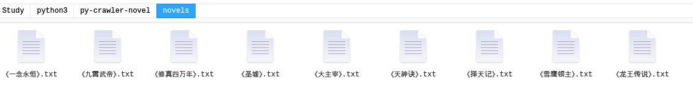

## 用python爬取目标小说
1. 语言：Python3.5以上
2. 使用**多进程+多协程**模式加快爬取效率
3. 使用`aiohttp`模块来模拟浏览器请求，`asyncio`模块来实现**多协程**，`multiprocessing`模块来实现多进程
4. 爬去网站：`http://www.biqiuge.com/`
5. 实现：先在`config_http.py`中的`urls`中设置该网站中要爬取的目标小说链接，如`http://www.biqiuge.com/book/158/`，然后运行`python3 crawler.py`即可开始爬取，并将小说保存到novels中（注意先要在根目录下手动创建`novels`文件夹）
6. 第一次学习python，该小小项目只能用来玩玩，熟练下Python，编程风格和思路尚有待改进，也存在一些缺陷，有时会出现卡主的问题，也没有处理获取失败时该如何处理的逻辑，且效率还有很大的提升空间，在网络正常下，一部三千多章节的小说，爬取+保存大概需要30多秒。
7. 爬取结果展示

